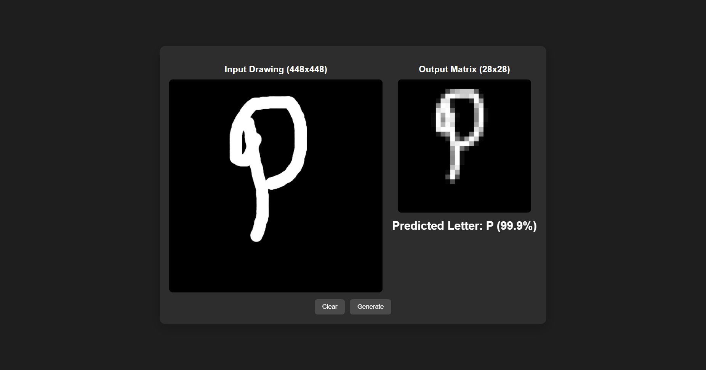

# Letter Recognition using CNN

This repository contains a project that uses a Convolutional Neural Network (CNN) to recognize letters drawn by users. The project is designed to work with a custom drawing canvas of **448x448 pixels**, which is then downscaled to the required **28x28 pixels** using a pixel value averaging method. The current model is trained to recognize only **capital English alphabets (A-Z)** and outputs the prediction along with a confidence percentage.

## Project Overview

- **Drawing Canvas:** Users draw on a 448x448 pixel canvas.
- **Downscaling:** The drawn image is downscaled to 28x28 pixels using pixel averaging.
- **Letter Recognition:** A CNN processes the downscaled image to predict the drawn letter.
- **Confidence Output:** The model provides a confidence percentage with its prediction.

## Dataset

The model is trained on a curated dataset of capital letters. You can find and download the dataset from the following link:

[**Dataset Link Here**](https://www.kaggle.com/datasets/ashishguptajiit/handwritten-az/data)

## Project Screenshot

Here's a screenshot of the project in action:

